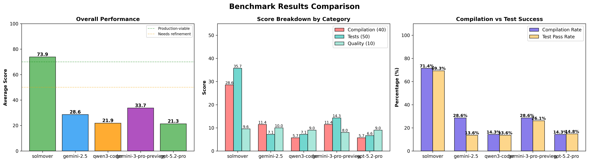

# Sui Move Translation Benchmark Results

**Benchmark Date:** 2026-01-06 13:25:24

**Total Test Cases:** 88 comprehensive unit tests across 7 contracts

## Visual Comparison

## Scoring System

- **Compilation (40 points):** Code compiles without errors
- **Test Pass Rate (50 points):** (Tests Passed / Expected Tests) × 50
- **Code Quality (10 points):** Based on warning count
- **Total Score:** Sum of all categories (max 100 per contract)

## Detailed Results by Contract

| Contract | Model | Compiles | Tests Passed | Expected | Pass Rate | Warnings | Score |
|----------|-------|----------|--------------|----------|-----------|----------|-------|
| 0_hello_world | solmover | ✅ | 11 | 11 | 100.0% | 0 | 100.0/100 |
| 0_hello_world | gemini-2.5 | ❌ | 0 | 11 | 0.0% | 0 | 10.0/100 |
| 0_hello_world | qwen3-coder | ❌ | 0 | 11 | 0.0% | 0 | 10.0/100 |
| 0_hello_world | gemini-3-pro-preview | ✅ | 11 | 11 | 100.0% | 17 | 93.0/100 |
| 0_hello_world | gpt-5.2-pro | ❌ | 0 | 11 | 0.0% | 0 | 10.0/100 |
| 0_hello_world | claude-4.5-sonnet | ✅ | 11 | 11 | 100.0% | 11 | 93.0/100 |
| 1_tipjar | solmover | ✅ | 12 | 12 | 100.0% | 0 | 100.0/100 |
| 1_tipjar | gemini-2.5 | ✅ | 12 | 12 | 100.0% | 0 | 100.0/100 |
| 1_tipjar | qwen3-coder | ✅ | 12 | 12 | 100.0% | 15 | 93.0/100 |
| 1_tipjar | gemini-3-pro-preview | ❌ | 0 | 12 | 0.0% | 0 | 10.0/100 |
| 1_tipjar | gpt-5.2-pro | ❌ | 0 | 12 | 0.0% | 0 | 10.0/100 |
| 1_tipjar | claude-4.5-sonnet | ✅ | 12 | 12 | 100.0% | 14 | 93.0/100 |
| 2_guestbook | solmover | ✅ | 12 | 12 | 100.0% | 0 | 100.0/100 |
| 2_guestbook | gemini-2.5 | ❌ | 0 | 12 | 0.0% | 0 | 10.0/100 |
| 2_guestbook | qwen3-coder | ❌ | 0 | 12 | 0.0% | 0 | 10.0/100 |
| 2_guestbook | gemini-3-pro-preview | ✅ | 12 | 12 | 100.0% | 15 | 93.0/100 |
| 2_guestbook | gpt-5.2-pro | ❌ | 0 | 12 | 0.0% | 0 | 10.0/100 |
| 2_guestbook | claude-4.5-sonnet | ❌ | 0 | 12 | 0.0% | 0 | 10.0/100 |
| 3_todo_list | solmover | ❌ | 0 | 14 | 0.0% | 0 | 10.0/100 |
| 3_todo_list | gemini-2.5 | ❌ | 0 | 14 | 0.0% | 0 | 10.0/100 |
| 3_todo_list | qwen3-coder | ❌ | 0 | 14 | 0.0% | 0 | 10.0/100 |
| 3_todo_list | gemini-3-pro-preview | ❌ | 0 | 14 | 0.0% | 0 | 10.0/100 |
| 3_todo_list | gpt-5.2-pro | ❌ | 0 | 14 | 0.0% | 0 | 10.0/100 |
| 3_todo_list | claude-4.5-sonnet | ❌ | 0 | 14 | 0.0% | 0 | 10.0/100 |
| 4_simple_coin | solmover | ✅ | 12 | 12 | 100.0% | 0 | 100.0/100 |
| 4_simple_coin | gemini-2.5 | ❌ | 0 | 12 | 0.0% | 0 | 10.0/100 |
| 4_simple_coin | qwen3-coder | ❌ | 0 | 12 | 0.0% | 0 | 10.0/100 |
| 4_simple_coin | gemini-3-pro-preview | ❌ | 0 | 12 | 0.0% | 0 | 10.0/100 |
| 4_simple_coin | gpt-5.2-pro | ❌ | 0 | 12 | 0.0% | 0 | 10.0/100 |
| 4_simple_coin | claude-4.5-sonnet | ❌ | 0 | 12 | 0.0% | 0 | 10.0/100 |
| 5_counter | solmover | ✅ | 14 | 14 | 100.0% | 1 | 97.0/100 |
| 5_counter | gemini-2.5 | ❌ | 0 | 14 | 0.0% | 0 | 10.0/100 |
| 5_counter | qwen3-coder | ❌ | 0 | 14 | 0.0% | 0 | 10.0/100 |
| 5_counter | gemini-3-pro-preview | ❌ | 0 | 14 | 0.0% | 0 | 10.0/100 |
| 5_counter | gpt-5.2-pro | ✅ | 13 | 14 | 92.9% | 18 | 89.4/100 |
| 5_counter | claude-4.5-sonnet | ✅ | 14 | 14 | 100.0% | 6 | 93.0/100 |
| 6_weather_oracle | solmover | ❌ | 0 | 13 | 0.0% | 0 | 10.0/100 |
| 6_weather_oracle | gemini-2.5 | ✅ | 0 | 13 | 0.0% | 0 | 50.0/100 |
| 6_weather_oracle | qwen3-coder | ❌ | 0 | 13 | 0.0% | 0 | 10.0/100 |
| 6_weather_oracle | gemini-3-pro-preview | ❌ | 0 | 13 | 0.0% | 0 | 10.0/100 |
| 6_weather_oracle | gpt-5.2-pro | ❌ | 0 | 13 | 0.0% | 0 | 10.0/100 |
| 6_weather_oracle | claude-4.5-sonnet | ❌ | 0 | 13 | 0.0% | 0 | 10.0/100 |

## Summary Statistics

| Model | Avg Score | Compilation Rate | Avg Test Pass Rate | Total Tests Passed |
|-------|-----------|------------------|--------------------|--------------------|
| solmover | 73.9/100 | 71.4% | 69.3% | 61/88 |
| gemini-2.5 | 28.6/100 | 28.6% | 13.6% | 12/88 |
| qwen3-coder | 21.9/100 | 14.3% | 13.6% | 12/88 |
| gemini-3-pro-preview | 33.7/100 | 28.6% | 26.1% | 23/88 |
| gpt-5.2-pro | 21.3/100 | 14.3% | 14.8% | 13/88 |
| claude-4.5-sonnet | 45.6/100 | 42.9% | 42.0% | 37/88 |

## Score Breakdown by Category

| Model | Avg Compilation | Avg Test Score | Avg Quality |
|-------|-----------------|----------------|-------------|
| solmover | 28.6/40 | 35.7/50 | 9.6/10 |
| gemini-2.5 | 11.4/40 | 7.1/50 | 10.0/10 |
| qwen3-coder | 5.7/40 | 7.1/50 | 9.0/10 |
| gemini-3-pro-preview | 11.4/40 | 14.3/50 | 8.0/10 |
| gpt-5.2-pro | 5.7/40 | 6.6/50 | 9.0/10 |
| claude-4.5-sonnet | 17.1/40 | 21.4/50 | 7.0/10 |

## Statistical Analysis

### Overall Comparison (Chi-Square Test)

Testing whether test pass rates differ significantly across models (n=88 tests):

- **χ² statistic:** 103.79
- **p-value:** 8.38e-21 ***
- **Degrees of freedom:** 5

**Interpretation:** Highly significant difference in test pass rates across models (p < 0.001).

### Pairwise Comparisons (Fisher's Exact Test)

| Comparison | Pass Rate Difference | p-value | Significance |
|------------|---------------------|---------|-------------|
| solmover vs gemini-2.5 | +55.7% | 0.000 | ✓ *** |
| solmover vs qwen3-coder | +55.7% | 0.000 | ✓ *** |
| solmover vs gemini-3-pro-preview | +43.2% | 0.000 | ✓ *** |
| solmover vs gpt-5.2-pro | +54.5% | 0.000 | ✓ *** |
| solmover vs claude-4.5-sonnet | +27.3% | 0.000 | ✓ *** |
| gemini-2.5 vs qwen3-coder | +0.0% | 1.000 | ns |
| gemini-2.5 vs gemini-3-pro-preview | -12.5% | 0.058 | ns |
| gemini-2.5 vs gpt-5.2-pro | -1.1% | 1.000 | ns |
| gemini-2.5 vs claude-4.5-sonnet | -28.4% | 0.000 | ✓ *** |
| qwen3-coder vs gemini-3-pro-preview | -12.5% | 0.058 | ns |
| qwen3-coder vs gpt-5.2-pro | -1.1% | 1.000 | ns |
| qwen3-coder vs claude-4.5-sonnet | -28.4% | 0.000 | ✓ *** |
| gemini-3-pro-preview vs gpt-5.2-pro | +11.4% | 0.092 | ns |
| gemini-3-pro-preview vs claude-4.5-sonnet | -15.9% | 0.038 | ✓ * |
| gpt-5.2-pro vs claude-4.5-sonnet | -27.3% | 0.000 | ✓ *** |

*Significance levels: *** p<0.001, ** p<0.01, * p<0.05, ns = not significant*

### Confidence Intervals (95% Wilson Score)

| Model | Test Pass Rate | 95% Confidence Interval |
|-------|---------------|------------------------|
| solmover | 69.3% | [59.0% - 78.0%] |
| gemini-2.5 | 13.6% | [8.0% - 22.3%] |
| qwen3-coder | 13.6% | [8.0% - 22.3%] |
| gemini-3-pro-preview | 26.1% | [18.1% - 36.2%] |
| gpt-5.2-pro | 14.8% | [8.8% - 23.7%] |
| claude-4.5-sonnet | 42.0% | [32.3% - 52.5%] |

## Error Analysis

### Top 5 Most Common Errors

#### 1. E03003: Unbound module member

**Total occurrences:** 16

**Models affected:**
- gpt-5.2-pro: 6
- gemini-2.5: 4
- solmover: 2
- gemini-3-pro-preview: 2
- claude-4.5-sonnet: 2

#### 2. E05001: Ability constraint not satisfied

**Total occurrences:** 14

**Models affected:**
- qwen3-coder: 4
- gpt-5.2-pro: 3
- gemini-2.5: 2
- gemini-3-pro-preview: 2
- claude-4.5-sonnet: 2
- solmover: 1

#### 3. E03002: Unbound module

**Total occurrences:** 13

**Models affected:**
- gpt-5.2-pro: 4
- qwen3-coder: 3
- gemini-2.5: 2
- gemini-3-pro-preview: 2
- claude-4.5-sonnet: 2

#### 4. E04007: Incompatible types

**Total occurrences:** 10

**Models affected:**
- gemini-2.5: 2
- gemini-3-pro-preview: 2
- gpt-5.2-pro: 2
- claude-4.5-sonnet: 2
- solmover: 1
- qwen3-coder: 1

#### 5. E03004: Unbound type

**Total occurrences:** 9

**Models affected:**
- gpt-5.2-pro: 3
- qwen3-coder: 2
- gemini-3-pro-preview: 2
- gemini-2.5: 1
- claude-4.5-sonnet: 1

